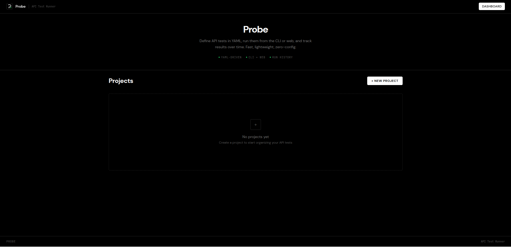
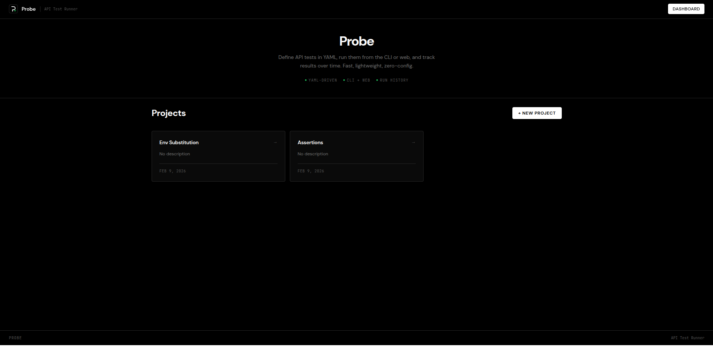
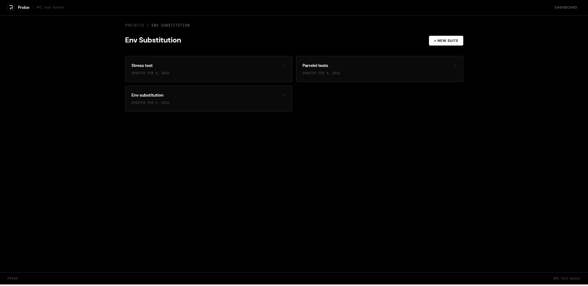
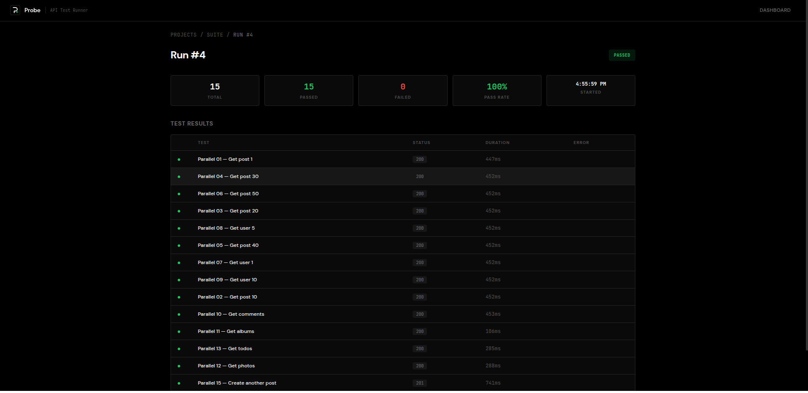

<p align="center">
  
</p>

<h1 align="center">Probe</h1>

<p align="center">
  <strong>Fast, lightweight API test runner for the command line and web.</strong><br />
  Define tests in YAML. Run from CLI or browser. Track results over time.
</p>

<p align="center">
  
  
  
  
</p>

---

## Screenshots

<!-- Replace these placeholders with actual screenshots -->

| Dashboard | Project View |
|:-:|:-:|
|  |  |

| Suite View | Run Results |
|:-:|:-:|
|  |  |

| CLI Output |
|:-:|
|  |

> **Note:** Add screenshots to `docs/screenshots/` to populate the images above.

---

## Quick Start

### Install

```bash
go install github.com/dawgdevv/probe@latest
```

This installs the binary as `probe`.

Or build from source:

```bash
git clone https://github.com/dawgdevv/probe.git
cd apitestercli
make build-all
```

### Define Tests

Create a `tests.yaml` file:

```yaml
env:
  base_url: https://jsonplaceholder.typicode.com
  user_id: "1"

tests:
  - name: Get all posts
    request:
      method: GET
      path: /posts
    expect:
      status: 200

  - name: Get single post
    request:
      method: GET
      path: /posts/{{user_id}}
    expect:
      status: 200

  - name: Create a post
    request:
      method: POST
      path: /posts
      headers:
        Content-Type: application/json
      body:
        title: "Hello"
        body: "World"
        userId: "{{user_id}}"
    expect:
      status: 201
```

### Run from CLI

```bash
# Run tests and see results in terminal
probe run tests.yaml
```

Exit code is `1` if any test fails — CI/CD friendly out of the box.

### Run from Web

```bash
# Start the web server (embedded UI)
probe serve

# Custom port
probe serve -p 9000

# Custom data directory
probe serve -d /path/to/data
```

Open `http://localhost:3000` in your browser to access the dashboard.

---

## Architecture

```
probe/
├── cmd/                    # CLI commands (run, serve)
│   ├── root.go             # Root cobra command
│   ├── run.go              # `probe run` — execute YAML tests
│   └── serve.go            # `probe serve` — start web server
├── internal/
│   ├── api/                # REST API (Gin handlers + routes)
│   ├── assert/             # JSON assertion engine
│   ├── config/             # Env variable substitution ({{var}})
│   ├── executor/           # HTTP test executor
│   ├── formatter/          # Output formatters (console, JSON)
│   ├── loader/             # YAML test suite parser
│   ├── service/            # Test runner orchestration
│   ├── storage/            # SQLite persistence layer
│   └── web/                # Embedded frontend (go:embed)
├── pkg/models/             # Shared data models
├── web/                    # React frontend (Vite + TypeScript)
│   └── src/
│       ├── api/            # API client
│       ├── components/     # Layout shell
│       └── pages/          # Dashboard, Project, Suite, Run views
├── Makefile                # Build automation
├── tests.yaml              # Example test suite
└── FEATURES.md             # Detailed feature tracker
```

---

## YAML Test Format

| Field | Description |
|---|---|
| `env` | Key-value map of environment variables |
| `env.base_url` | **Required.** Base URL for all requests |
| `tests[].name` | Human-readable test name |
| `tests[].request.method` | HTTP method (`GET`, `POST`, `PUT`, `DELETE`) |
| `tests[].request.path` | URL path (supports `{{var}}` substitution) |
| `tests[].request.headers` | Optional request headers |
| `tests[].request.body` | Optional JSON body |
| `tests[].expect.status` | Expected HTTP status code |
| `tests[].expect.json` | Optional JSON field assertions |

### JSON Assertions

```yaml
expect:
  status: 200
  json:
    id: 1                    # Exact match
    title: "hello"           # String match
    "$.length": ">5"         # Array length comparison
    "user.name": "John"      # Nested field access (dot notation)
```

---

## Web API

When running `probe serve`, the following REST endpoints are available:

| Method | Endpoint | Description |
|---|---|---|
| `GET` | `/api/health` | Health check |
| `GET` | `/api/projects` | List all projects |
| `POST` | `/api/projects` | Create a project |
| `GET` | `/api/projects/:id` | Get project details |
| `GET` | `/api/projects/:id/suites` | List suites in a project |
| `POST` | `/api/suites` | Create a test suite |
| `GET` | `/api/suites/:id` | Get suite details |
| `POST` | `/api/suites/:id/run` | Execute a test suite |
| `GET` | `/api/suites/:id/runs` | List run history |
| `GET` | `/api/runs/:id` | Get run details |
| `GET` | `/api/runs/:id/results` | Get test results for a run |

---

## Development

```bash
# Frontend dev server (hot reload, proxies to Go backend)
make dev-ui

# Go backend dev server
make dev-server

# Build frontend
make build-ui

# Build everything (frontend + Go binary)
make build-all

# Run example tests
make test

# Clean build artifacts
make clean
```

### Tech Stack

| Layer | Technology |
|---|---|
| CLI Framework | [Cobra](https://github.com/spf13/cobra) |
| HTTP Router | [Gin](https://github.com/gin-gonic/gin) |
| Database | SQLite via [modernc.org/sqlite](https://pkg.go.dev/modernc.org/sqlite) |
| Frontend | React 19 + TypeScript + Vite + Tailwind CSS 4 |
| Data Fetching | TanStack React Query |
| YAML Parser | [go-yaml v3](https://gopkg.in/yaml.v3) |

---

## License

MIT
